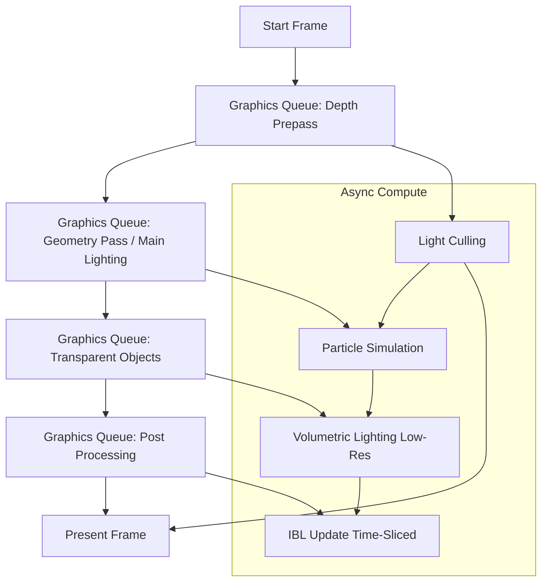

```mermaid
graph TD
    A[Start Frame] --> B[Graphics Queue: Depth Prepass]
    B --> C[Graphics Queue: Geometry Pass / Main Lighting]
    C --> D[Graphics Queue: Transparent Objects]
    D --> E[Graphics Queue: Post Processing]
    E --> F[Present Frame]

    subgraph AsyncCompute [Async Compute]
        G[Light Culling] --> H[Particle Simulation]
        H --> I[Volumetric Lighting Low-Res]
        I --> J[IBL Update Time-Sliced]
    end

    B --> G
    G --> F
    C --> H
    D --> I
    E --> J
```