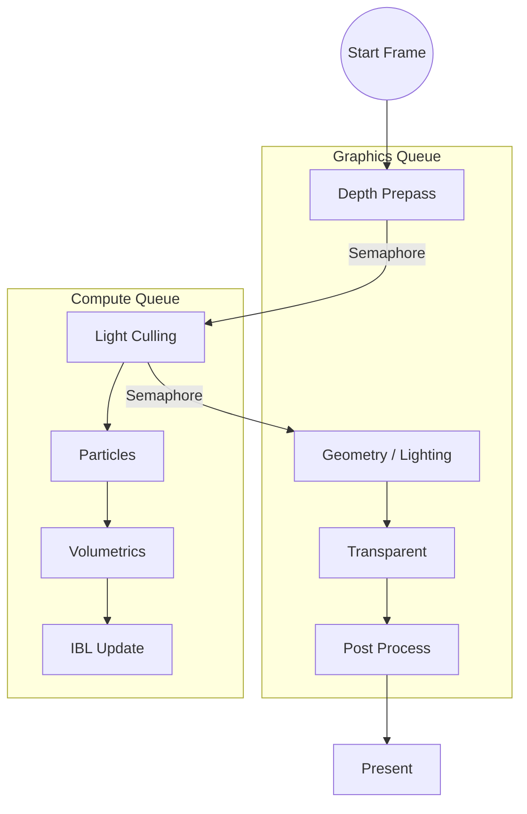

# Architectural Improvements Plan: Advanced Render Graph & Async Compute

Based on the analysis of `renderGraph.md` and `frameDependency.md`, this document outlines the plan to transition the current simple rendering loop into a robust, graph-based rendering architecture with async compute capabilities.

## 1. Core Render Graph Refactoring (The FrameGraph)

We will implement a **FrameGraph** architecture (inspired by Frostbite). This differs from a static RenderGraph in that it is rebuilt every frame, allowing for dynamic enabling/disabling of passes and optimal resource management.

### 1.1 Data Structures
- **`FrameGraph` Class**: The builder and compiler.
    - `addPass<Data>(name, setup, execute)`: Templated method to add passes.
    - `compile()`: Culls unused passes, calculates resource lifetimes, inserts barriers.
    - `execute()`: Runs the actual command buffer recording.
- **`FrameGraphResource`**: A handle (integer ID) to a virtual resource.
    - The actual GPU resource (VkImage/VkBuffer) is only allocated during execution and reused (aliased) when not in use.
- **`RenderPass` Node**: Represents a unit of work (Draw or Compute).
    - Properties: Name, Queue Type (Graphics/Compute), Inputs (Resources), Outputs (Resources).
    - `execute(CommandBuffer& cmd)` method.
- **`RenderResource` Node**: Represents a GPU resource (Buffer, Image).
    - Properties: Type, Format, Size, Current State (Layout/Access).
    - **Transient Resources**: Resources that only exist for the duration of the frame (or part of it).
    - **Imported Resources**: External resources like the Swapchain Image or persistent buffers.

### 1.2 Dependency Tracking & Synchronization
- **Automatic Barriers**: The graph should analyze Read/Write dependencies between passes and automatically insert `vkCmdPipelineBarrier` to handle layout transitions and memory visibility.
- **Queue Management**:
    - Support for `GraphicsQueue` and `ComputeQueue`.
    - **Cross-Queue Synchronization**: When a Graphics pass depends on a Compute pass (or vice-versa), the graph must insert Semaphores or use Timeline Semaphores to synchronize execution.

## 2. Resource Management System

### 2.1 Resource Registry
- A centralized system to manage the lifecycle of resources defined in the graph.
- **Aliasing/Pooling**: Implement a memory allocator that allows reusing memory for resources that are never alive at the same time (to save VRAM).

### 2.2 Specific Resources (from Diagram)
- **`Camera`**: Uniform Buffer (View/Proj matrices).
- **`Lights SSBO`**: Storage Buffer containing light data.
- **`Depth Buffer`**: Depth attachment.
- **`HDR Color`**: Floating point color attachment (e.g., R16G16B16A16_SFLOAT).
- **`IBL Cubemap`**: Environment map.
- **`Light Tiles`**: Storage Buffer/Image for culled lights (Forward+/Clustered).

## 3. Implementation of Render Passes

We will restructure the rendering loop into the following distinct passes:

### 3.1 Graphics Queue (Main Path)
1.  **`Depth Prepass`**:
    - **Input**: Camera, Vertex Data.
    - **Output**: Depth Buffer.
    - **Goal**: Prime the depth buffer to reduce overdraw in the lighting pass.
2.  **`Geometry / Main Lighting`**:
    - **Input**: Depth Buffer (Read-Only), Light Tiles, Lights SSBO, IBL, Camera.
    - **Output**: HDR Color Buffer.
    - **Technique**: Likely Forward+ or Clustered Forward given the "Light Tiles" dependency.
3.  **`Transparent Objects`**:
    - **Input**: Depth Buffer, HDR Color Buffer (Load & Store).
    - **Output**: HDR Color Buffer (Composite).
4.  **`Post Processing`**:
    - **Input**: HDR Color Buffer.
    - **Output**: Swapchain Image (Present).
    - **Features**: Tone Mapping, Bloom, etc.

### 3.2 Async Compute Queue
1.  **`Light Culling`**:
    - **Input**: Depth Buffer (from Prepass), Lights SSBO.
    - **Output**: Light Tiles.
    - **Sync**: Must wait for `Depth Prepass` to finish.
2.  **`Particle Simulation`**:
    - **Input**: Previous State.
    - **Output**: New Particle State (Vertex Buffer / SSBO).
3.  **`Volumetric Lighting (Low-Res)`**:
    - **Input**: Shadow Maps, Lights.
    - **Output**: Volumetric Fog Texture.
4.  **`IBL Update (Time-Sliced)`**:
    - **Input**: Environment.
    - **Output**: Convoluted Cubemaps (Irradiance/Prefilter).
    - **Note**: Run only occasionally or slice work across frames.

## 4. Execution Flow & Synchronization Plan

The execution will follow this dependency chain:

## 5. Action Plan / Next Steps

1.  **Refactor `RenderGraph.hpp`**: Define the `Pass` and `Resource` structures.
2.  **Update `Renderer.cpp`**: Remove hardcoded passes and integrate the new Graph `execute()` method.
3.  **Implement `LightCulling` Compute Shader**: This is a prerequisite for the new Geometry pass.
4.  **Split `GeometryPass`**: Separate Depth Prepass from the Main Lighting pass.
5.  **Setup Synchronization**: Implement the semaphore logic for the Depth -> Light Cull -> Geometry dependency.
