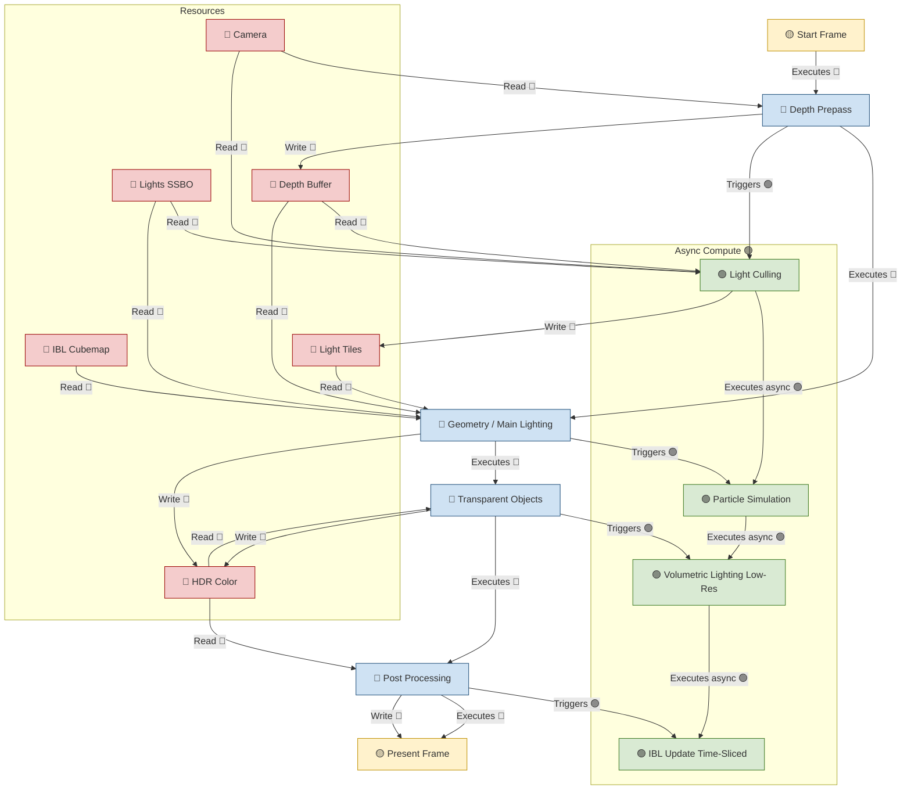

```mermaid
graph TD
    %% =================================
    %% Legend (for understanding)
    %% =================================
    %% 🔵 = GPU-bound / graphics queue
    %% 🟢 = Async compute / GPU or CPU
    %% 🟡 = CPU-side / preparation
    %% 🧱 = Resource node
    %% Arrow labels: "Executes", "Read", "Write", "Triggers"

    %% =================================
    %% Main Graphics Passes (GPU-bound 🔵)
    %% =================================
    A[🟡 Start Frame] -->|Executes 🔵| B[🔵 Depth Prepass]
    B -->|Executes 🔵| C[🔵 Geometry / Main Lighting]
    C -->|Executes 🔵| D[🔵 Transparent Objects]
    D -->|Executes 🔵| E[🔵 Post Processing]
    E -->|Executes 🔵| F[🟡 Present Frame]

    %% =================================
    %% Async Compute Tasks (Async 🟢)
    %% =================================
    subgraph AsyncCompute [Async Compute 🟢]
        G[🟢 Light Culling] -->|Executes async 🟢| H[🟢 Particle Simulation]
        H -->|Executes async 🟢| I[🟢 Volumetric Lighting Low-Res]
        I -->|Executes async 🟢| J[🟢 IBL Update Time-Sliced]
    end

    %% =================================
    %% Resources (🧱)
    %% =================================
    subgraph Resources
        Camera[🧱 Camera]
        Lights[🧱 Lights SSBO]
        Depth[🧱 Depth Buffer]
        HDR[🧱 HDR Color]
        IBL[🧱 IBL Cubemap]
        Tiles[🧱 Light Tiles]
    end

    %% =================================
    %% Resource Dependencies (Read/Write 🧱)
    %% =================================
    Camera -->|Read 🧱| B
    B -->|Write 🧱| Depth

    Camera -->|Read 🧱| G
    Lights -->|Read 🧱| G
    Depth -->|Read 🧱| G
    G -->|Write 🧱| Tiles

    Tiles -->|Read 🧱| C
    Lights -->|Read 🧱| C
    IBL -->|Read 🧱| C
    Depth -->|Read 🧱| C
    C -->|Write 🧱| HDR
    HDR -->|Read 🧱| D
    D -->|Write 🧱| HDR
    HDR -->|Read 🧱| E
    E -->|Write 🧱| F

    %% =================================
    %% Async Integration with Main Passes
    %% =================================
    B -->|Triggers 🟢| G
    C -->|Triggers 🟢| H
    D -->|Triggers 🟢| I
    E -->|Triggers 🟢| J

    %% =================================
    %% Notes (visual reminders)
    %% =================================
    classDef gpu fill:#cfe2f3,stroke:#1f4e79,stroke-width:1px;
    classDef async fill:#d9ead3,stroke:#38761d,stroke-width:1px;
    classDef cpu fill:#fff2cc,stroke:#bf9000,stroke-width:1px;
    classDef resource fill:#f4cccc,stroke:#990000,stroke-width:1px;

    class B,C,D,E gpu
    class G,H,I,J async
    class A,F cpu
    class Camera,Lights,Depth,HDR,IBL,Tiles resource
```