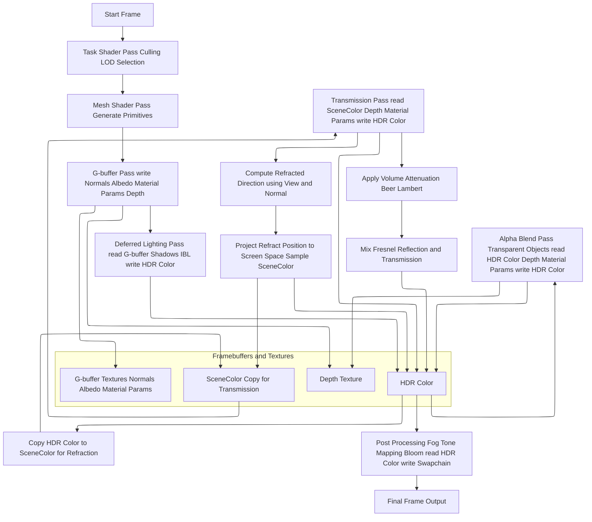
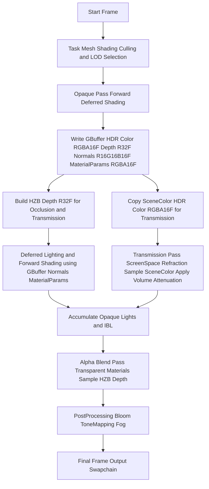

```mermaid
%%{init: {"flowchart": {"defaultRenderer": "elk"}} }%%
flowchart TD
    %% Frame start
    A[Start Frame] --> B[Task Shader Pass Culling LOD Selection]
    B --> C[Mesh Shader Pass Generate Primitives]

    %% Deferred opaque pass
    C --> D[G-buffer Pass write Normals Albedo Material Params Depth]
    D --> D1[G-buffer Textures Normals Albedo Material Params]
    D --> D2[Depth Texture]

    %% Deferred lighting pass
    D --> E[Deferred Lighting Pass read G-buffer Shadows IBL write HDR Color]
    E --> F1[HDR Color Texture]

    %% Transmission pass
    F1 --> G[Copy HDR Color to SceneColor for Refraction]
    G --> G1[SceneColor Copy Texture]
    G1 --> H[Transmission Pass read SceneColor Depth Material Params write HDR Color]
    H --> F1

    H --> I[Compute Refracted Direction using View and Normal]
    I --> J[Project Refract Position to Screen Space Sample SceneColor]
    J --> G1
    J --> F1
    H --> K[Apply Volume Attenuation Beer Lambert]
    K --> L[Mix Fresnel Reflection and Transmission]
    L --> F1

    %% Forward alpha blend pass
    F1 --> N[Alpha Blend Pass Transparent Objects read HDR Color Depth Material Params write HDR Color]
    N --> F1
    N --> D2

    %% Post-processing
    F1 --> P[Post Processing Fog Tone Mapping Bloom read HDR Color write Swapchain]
    P --> Q[Final Frame Output]

    %% Notes on textures
    subgraph FB[Framebuffers and Textures]
        D1[G-buffer Textures Normals Albedo Material Params]
        D2[Depth Texture]
        F1[HDR Color]
        G1[SceneColor Copy for Transmission]
    end
```

```mermaid

flowchart TD
    %% Task/Mesh shading stage
    A[Start Frame] --> B[Task Mesh Shading Culling and LOD Selection]

    %% Opaque pass with G-buffer / MRTs
    B --> C[Opaque Pass Forward Deferred Shading]
    C --> D[Write GBuffer HDR Color RGBA16F Depth R32F Normals R16G16B16F MaterialParams RGBA16F]

    %% HZB generation from depth
    D --> E[Build HZB Depth R32F for Occlusion and Transmission]

    %% SceneColor copy for screen-space refraction
    D --> F[Copy SceneColor HDR Color RGBA16F for Transmission]

    %% Lighting passes
    E --> G[Deferred Lighting and Forward Shading using GBuffer Normals MaterialParams]
    G --> I[Accumulate Opaque Lights and IBL]

    %% Transmission pass
    F --> H[Transmission Pass ScreenSpace Refraction Sample SceneColor Apply Volume Attenuation]
    H --> I

    %% Alpha blend / transparent objects
    I --> J[Alpha Blend Pass Transparent Materials Sample HZB Depth]

    %% Post-processing
    J --> K[PostProcessing Bloom ToneMapping Fog]

    %% Final output
    K --> L[Final Frame Output Swapchain]
```
